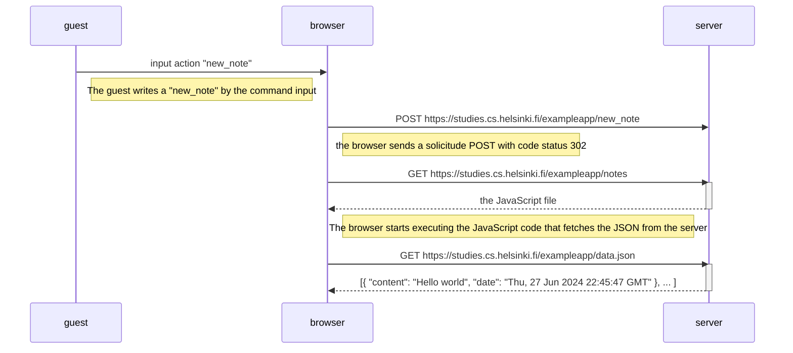

```mermaid
sequenceDiagram
    participant guest
    participant browser
    participant server

    guest->>browser: input action "new_note"
    Note right of guest: The guest writes a "new_note" by the command input
    browser->>server: POST https://studies.cs.helsinki.fi/exampleapp/new_note
    Note right of browser: the browser sends a solicitude POST with code status 302
    browser->>server: GET https://studies.cs.helsinki.fi/exampleapp/notes
    activate server
    server-->>browser: the JavaScript file
    deactivate server

    Note right of browser: The browser starts executing the JavaScript code that fetches the JSON from the server

    browser->>server: GET https://studies.cs.helsinki.fi/exampleapp/data.json
    activate server
    server-->>browser: [{ "content": "Hello world", "date": "Thu, 27 Jun 2024 22:45:47 GMT" }, ... ]
    deactivate server

```
