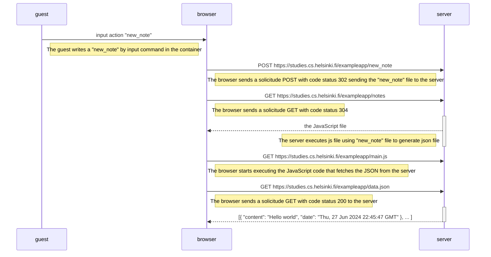

```mermaid
sequenceDiagram
    participant guest
    participant browser
    participant server

    guest->>browser: input action "new_note"
    Note right of guest: The guest writes a "new_note" by input command in the container
    browser->>server: POST https://studies.cs.helsinki.fi/exampleapp/new_note
    Note right of browser: The browser sends a solicitude POST with code status 302 sending the "new_note" file to the server
    browser->>server: GET https://studies.cs.helsinki.fi/exampleapp/notes
    Note right of browser: The browser sends a solicitude GET with code status 304
    activate server
    server-->>browser: the JavaScript file
    Note left of server: The server executes js file using "new_note" file to generate json file
    deactivate server
    browser->>server: GET https://studies.cs.helsinki.fi/exampleapp/main.js
    Note right of browser: The browser starts executing the JavaScript code that fetches the JSON from the server
    browser->>server: GET https://studies.cs.helsinki.fi/exampleapp/data.json
    Note right of browser: The browser sends a solicitude GET with code status 200 to the server
    activate server
    server-->>browser: [{ "content": "Hello world", "date": "Thu, 27 Jun 2024 22:45:47 GMT" }, ... ]
    deactivate server

```
