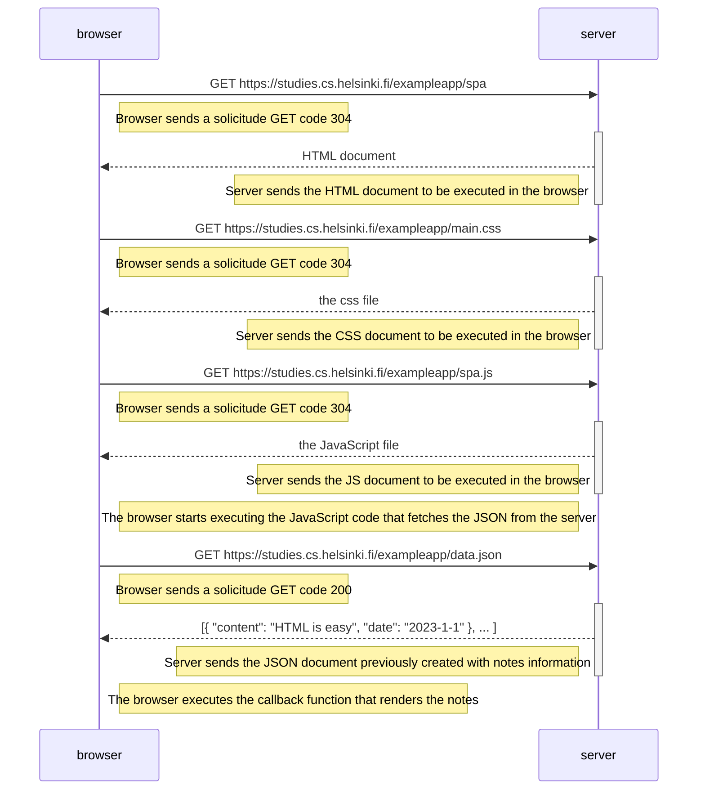

```mermaid
sequenceDiagram
    participant browser
    participant server

    browser->>server: GET https://studies.cs.helsinki.fi/exampleapp/spa
    Note right of browser: Browser sends a solicitude GET code 304
    activate server
    server-->>browser: HTML document
    Note left of server: Server sends the HTML document to be executed in the browser
    deactivate server

    browser->>server: GET https://studies.cs.helsinki.fi/exampleapp/main.css
    Note right of browser: Browser sends a solicitude GET code 304
    activate server
    server-->>browser: the css file
    Note left of server: Server sends the CSS document to be executed in the browser
    deactivate server
    
    browser->>server: GET https://studies.cs.helsinki.fi/exampleapp/spa.js
    Note right of browser: Browser sends a solicitude GET code 304
    activate server
    server-->>browser: the JavaScript file
    Note left of server: Server sends the JS document to be executed in the browser
    deactivate server

    Note right of browser: The browser starts executing the JavaScript code that fetches the JSON from the server

    browser->>server: GET https://studies.cs.helsinki.fi/exampleapp/data.json
    Note right of browser: Browser sends a solicitude GET code 200
    activate server
    server-->>browser: [{ "content": "HTML is easy", "date": "2023-1-1" }, ... ]
    Note left of server: Server sends the JSON document previously created with notes information
    deactivate server

    Note right of browser: The browser executes the callback function that renders the notes
```
