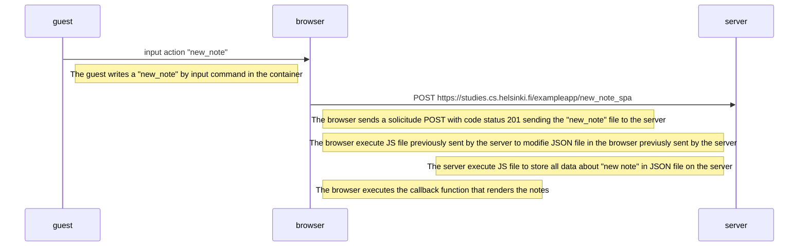

```mermaid
sequenceDiagram
    participant guest
    participant browser
    participant server

    guest->>browser: input action "new_note"
    Note right of guest: The guest writes a "new_note" by input command in the container
    browser->>server: POST https://studies.cs.helsinki.fi/exampleapp/new_note_spa
    Note right of browser: The browser sends a solicitude POST with code status 201 sending the "new_note" file to the server
    Note right of browser: The browser execute JS file previously sent by the server to modifie JSON file in the browser previusly sent by the server
    Note left of server: The server execute JS file to store all data about "new note" in JSON file on the server
    Note right of browser: The browser executes the callback function that renders the notes
```
